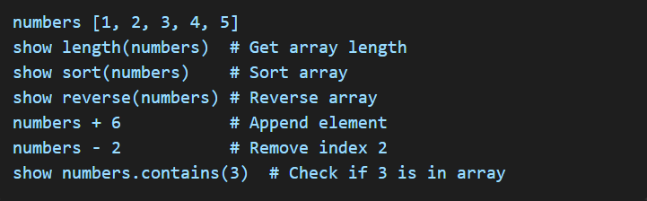

# LASH
 a compiled programming language with an easy-to-understand syntax and high performance
 
 LASH PROGRAMMING LANGUAGE DOCUMENTATION

Introduction

Lash is a simple, object-oriented programming language inspired by Python, C++, and Java. It is designed for readability and ease of use while maintaining powerful object-oriented features. Lash eliminates the need for "self" when accessing attributes and methods within a class, making it similar to C++ and Java.

1. Basic Syntax

Lash uses a simple and clean syntax where variable declarations do not require var or =. The type is inferred automatically.

1.1 Variable

No need for = or var
Type is inferred automatically.
Strings are enclosed in double quotes " ".
Numbers, floats, and booleans do not require special declaration.

1.2 Type Casting

to_num converts to an integer.
to_str converts to a string.
to_float converts to a float.

2. Input & Output

2.1 Displaying Output

2.2 Taking User Input

Default values can be provided: city ask "Enter city:" "New York"
Multipe values: x, y ask "Enter two numbers; "

3. Operators

3.1 Airthmetic Operators

+ , - , * , / , % , **

3.2 Comaprison Operators

= , != , > , < , >= , <= 

Example

3.3 Logical Operators

and , or , not

Example

4. Control Flow

4.1 If-Else Statements

4.2 If-Elseif-Else Statements

4.3 Loops

Repeat (for loop)

Loop (while loop) 

5. Functions

5.1 Definig & Calling Functions

5.2 Returning Values

6. Arrays, Sets, Dictionary Functions

6.1 Creating and Accessing Arrays

6.2 Modifying Arrays

6.3 Array Operations

Lash also supports Multi-dimensional arrays and functions.

6.4 Sets (Unique Values)

6.4.1 Set Operations

Adding Elements

Removing Elements

Checking Membership

Set Union (Combine Two Sets)

6.5 Dictionary (Key-Value Pairs)

6.6 Tuples

7. Object-Oriented Programming (OOP)

7.1 Defining a Class

7.2 Crating Objects 

7.3 Inheritance

7.4 Encapsulation

7.5 Polymorphism

8. Error Handling

8.1 Try-Catch Mechanism

Conclusion

Lash is designed to be easy to learn while supporting powerful OOP features like Java and C++. It simplifies syntax while keeping familiar programming paradigms. Happy coding in Lash!