# LASH
LASH PROGRAMMING LANGUAGE DOCUMENTATION

Introduction

Lash is a simple, object-oriented programming language inspired by Python, C++, and Java. It is designed for readability and ease of use while maintaining powerful object-oriented features. Lash eliminates the need for "self" when accessing attributes and methods within a class, making it similar to C++ and Java.

1. Basic Syntax

Lash uses a simple and clean syntax where variable declarations do not require var or =. The type is inferred automatically.

1.1 Variable

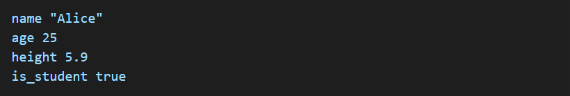

No need for = or var
Type is inferred automatically.
Strings are enclosed in double quotes " ".
Numbers, floats, and booleans do not require special declaration.

1.2 Type Casting

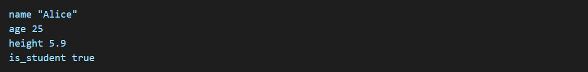

to_num converts to an integer.
to_str converts to a string.
to_float converts to a float.

2. Input & Output

2.1 Displaying Output

2.2 Taking User Input

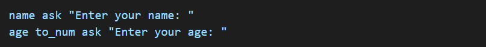

Default values can be provided: city ask "Enter city:" "New York"
Multipe values: x, y ask "Enter two numbers; "

2.2.1 HOW ask WORKS IN LASH ?

The "ask" function in Lash is used to take user input in a simple and intuitive way. It works similarly to "input()" in other languages but has additional features like default values and multiple inputs.

2.2.2 HOW ask RETURNS VALUES ?

By default, ask returns a string.
If you want a number, you need to convert it using to_num.

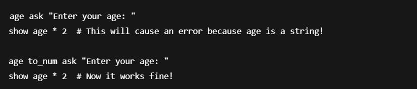

2.2.3 DEFAULT VALUES IN ask

If the user presses Enter without typing anything, ask can return a default value.

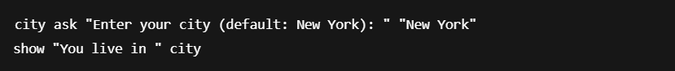

Example Input & Output

If the user enters "Los Angeles", the output will be:
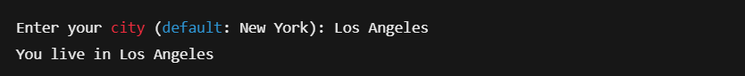

2.2.4 Multiple Inputs in One Line

Lash allows you to space-separate multiple inputs in a single ask.
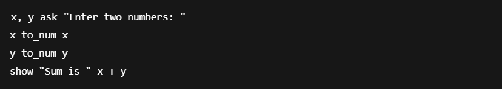

Example Input & Output
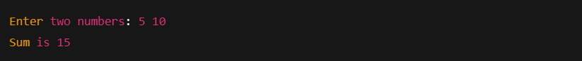

The user enters 5 10, and ask splits the input into x and y.
They are converted to numbers using to_num.

3. Operators

3.1 Airthmetic Operators

+ , - , * , / , % , **

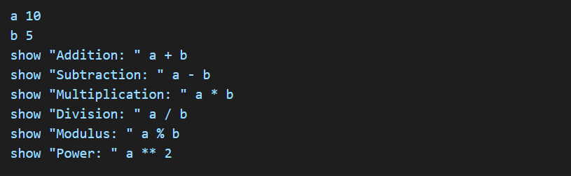

3.2 Comaprison Operators

= , != , > , < , >= , <= 

Example

3.3 Logical Operators

and , or , not

Example

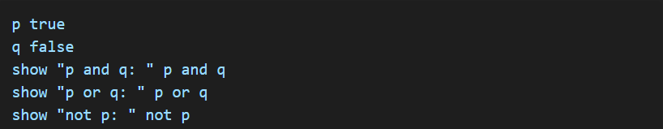

3.4 Assignment Operators

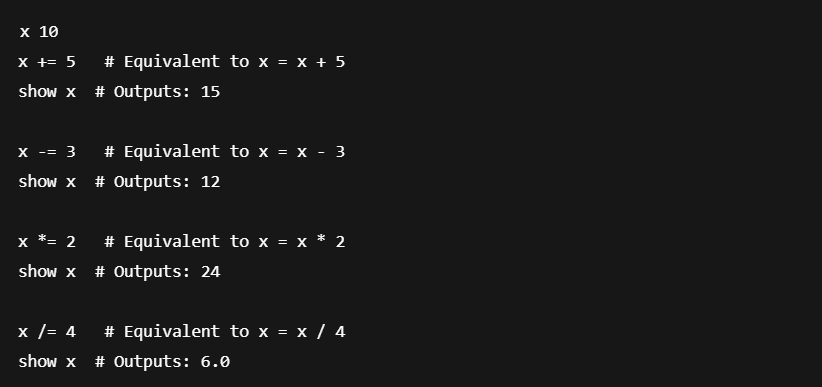

4. Control Flow

4.1 If-Else Statements

4.2 If-Elseif-Else Statements

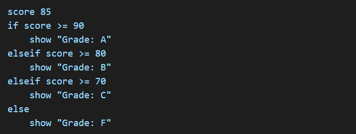

4.3 Loops

Repeat (for loop)

Loop (while loop) 

4.4 Breaking and Continuing Loops

4.4.1 Stop (Break) - Exit the loop early
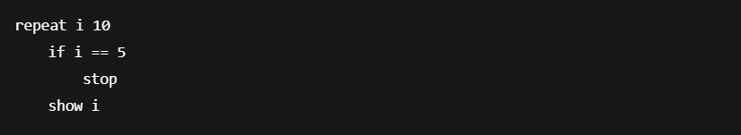

4.4.2 Skip (Continue) - Skip current itreation
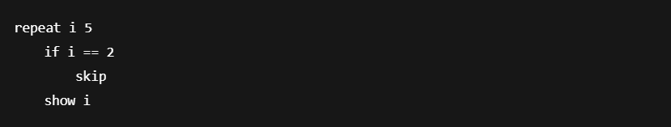

5. Functions

Lash should have a simple and clean function syntax. No need for def or complex syntax—just use a keyword like fn

5.1 Definig & Calling Functions

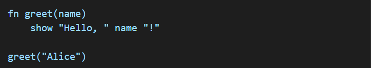

5.2 Returning Values

5.3 Function with/without parameters

a.Functions without parameters
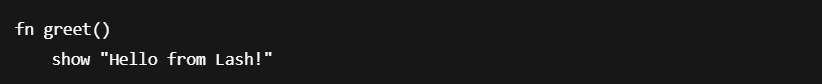

b.Functions with parameters
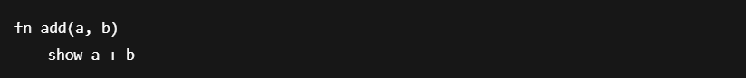

5.4 Functions with Return Value

5.5 Default Parameter Values

5.6 Recursive Function

6. Arrays, Sets, Dictionary Functions

Lash arrays should be simple and easy to manipulate. Here’s how arrays work in Lash, along with useful built-in functions.

6.1 Creating and Accessing Arrays

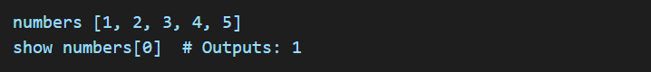

6.2 Modifying Arrays

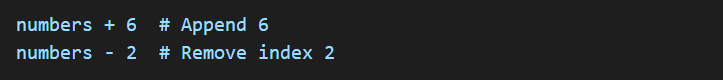

6.3 Array Operations

Adding Elements
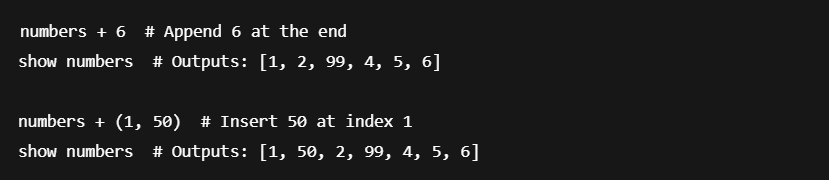

Removing Elements

Checking Array Length

Searching

Sorting

By default, sort() sorts numbers in ascending order.

Sorting in descending order:
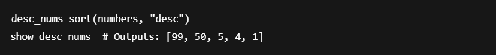

Reversing Array

Finding Index of an Element

Counting Occurrences of an Element

Joining Arrays
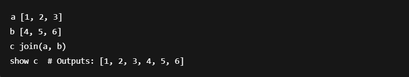

Slicing Array
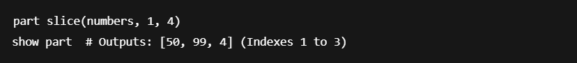

6.4 Multi-Dimensional Arrays (Matrices)

Lash should support multi-dimensional arrays for matrices and sets for unique values.

A multi-dimensional array is just an array of arrays.
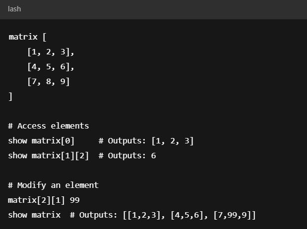

6.4.1 Multi-Dimensional Arrays(Matrices) Operations

Looping Through a Multi-Dimensional Array

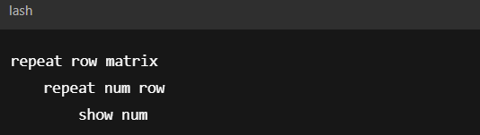

Getting the Number of Rows & Columns

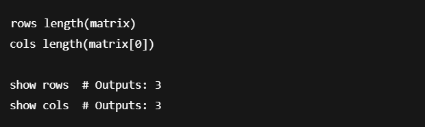

Transposing 

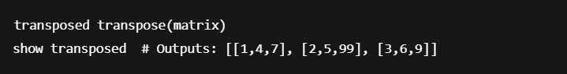

6.5 Sets (Unique Values)

A set is a collection of unique elements.

6.5.1 Set Operations

Adding Elements

Removing Elements

Checking Membership

Set Union (Combine Two Sets)

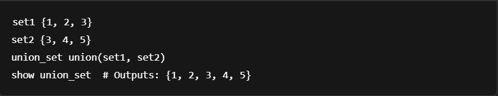

Set Intersection (Common Elements)

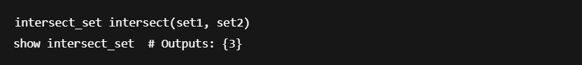

Set Difference (Elements in A but Not in B)

6.6 Dictionary (Key-Value Pairs)

6.7 Tuples

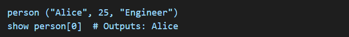

7. Strings and its Functions

Strings can be defined as variables are created.

7.1 String Functions

Finding length of a string
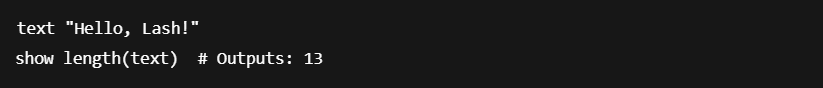

Changing Case
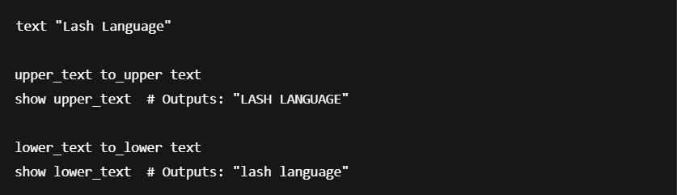

Checking if a string contains another string

Replacing parts of a string

Splitting a string into a list

Joining a list into string

Trimming Whitespace

Getting a Substring

8. Object-Oriented Programming (OOP)

Lash should have a simple and readable way to define and use classes and objects, avoiding unnecessary complexity.

8.1 Defining a Class

Lash uses class to define a class and fn for methods.

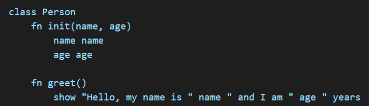

No self!
Directly access name and age inside the class.

8.2 Crating Objects 

Objects are created like in C++/Java, without new.

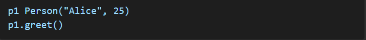

8.3 Modifying Attributes

Direct access, just like in Java/C++.

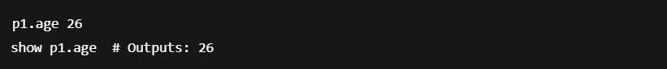

8.4 Class Methods (Static Methods Like Java)

Class methods work like static methods in Java.

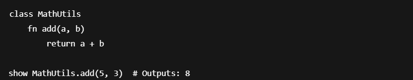

8.5 Private Attributes & Methods

Prefix with _ to make attributes/methods private (like C++ private).

_balance can’t be accessed directly outside the class.

8.5 Inheritance

No need for super – attributes are inherited directly.

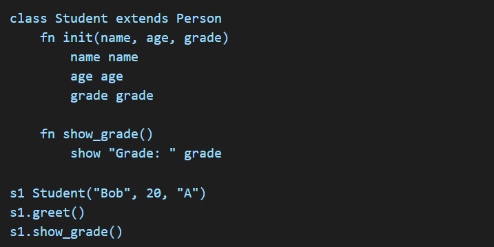

8.6 Encapsulation

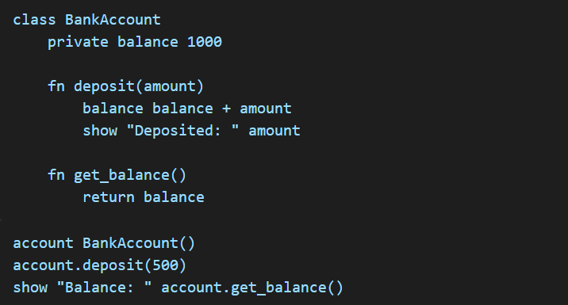

8.7 Polymorphism

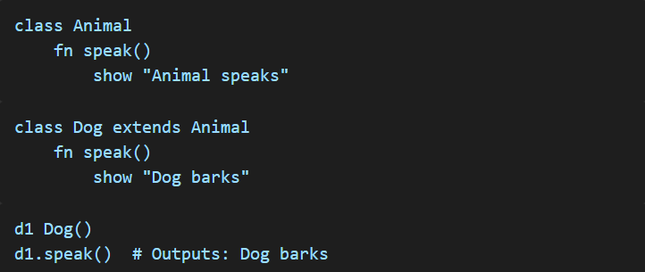

9. Error Handling

9.1 Try-Catch Mechanism

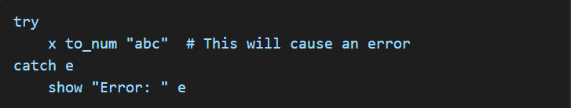

Conclusion

Lash is designed to be easy to learn while supporting powerful OOP features like Java and C++. It simplifies syntax while keeping familiar programming paradigms. Happy coding in Lash!